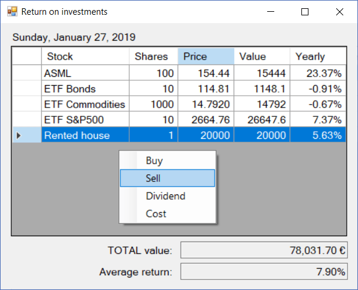

# InvestCalc
Program to keep track of investments and calculate their returns.

## Features
* Registers orders
(buy/sell shares, dividends/costs).

* Persistent disk database
(portfolio and order data persist between sessions).

* Displays the current portfolio
(currently owned shares of every stock).

* Automatically retrieve current stock prices from the Internet.
This is done when the `Stocks.fetchCodes` SQL column is properly set;
however it's not yet implemented to set this from the UI.

* Display and manipulate order history.
Can filter by dates and stocks.

* Import/export order history from/to CSV.

* Calculates the equivalent yearly return of each investment,
and all investments together.
This is done after the current price is known
-- either automatically retrieved or manually entered by the user.
The equivalent yearly return is defined as the interest/discount rate
that makes the net present value of all cash flows
equal to the current value
(current price multiplied by number of shares currently owned).

## Notes

* [**`Data_definition.sql`**](Data_definition.sql)
contains the SQLite database definition.
This file must be deployed in the application directory:
it would be read to create a fresh database
in case an existing one is not found for the user.

## Dependencies
* [libcs-math](https://github.com/XavierAP/libcs-math)
is used to calculate the returns,
by the iterative Newton's method.

* [libcs-sqlite](https://github.com/XavierAP/libcs-sqlite)
is used by
the [**`Data`**](Data.cs) class
for all SQL database features.
